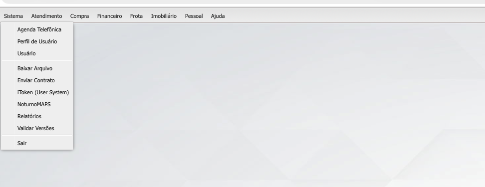

# Módulo de Clientes

## Objetivo

O módulo de clientes é o principal módulo do sistema HelpDesk.

Todo relacionamento comercial, contratual, financeiro, operacional e de suporte da Noturno Softwares parte do cadastro de clientes.

Os demais módulos possuem dependência direta ou indireta deste cadastro.

---

# Finalidade

Permitir o gerenciamento completo dos clientes da Noturno Softwares, incluindo:

* Dados cadastrais;
* Contratos;
* Assinaturas;
* Licenças;
* Ferramentas contratadas;
* Representantes;
* Franquias;
* Financeiro;
* Integrações;
* Instalações;
* Histórico.

---

# Tipos de Cliente

O sistema deve suportar dois tipos de cliente:

## Pessoa Jurídica

Identificada por:

* CNPJ
* Inscrição Estadual

Possui:

* Sócios
* Representantes legais
* Contratos assinados pelos sócios responsáveis

---

## Pessoa Física

Identificada por:

* CPF
* RG

Não possui obrigatoriedade de cadastro de sócios.

---

# Regras Gerais

## Não permitir duplicidade

Não pode existir:

* CPF duplicado
* CNPJ duplicado
* RG duplicado
* Inscrição Estadual duplicada

---

## Plano obrigatório

Todo cliente deve possuir pelo menos um plano ativo.

---

## Contrato obrigatório

O cliente somente poderá utilizar ferramentas da Noturno após a assinatura do contrato.

---

## Assinatura obrigatória

A assinatura do contrato deve ser realizada através da integração com a D4Sign.

API utilizada:

https://docapi.d4sign.com.br/docs/introdução-a-api

Estados possíveis:

* Aguardando assinatura
* Parcialmente assinado
* Assinado
* Cancelado
* Expirado

---

## Liberação de chaves

Enquanto o contrato não estiver assinado:

* Não gerar chaves de ativação;
* Não liberar ferramentas;
* Não permitir ativação definitiva.

Após assinatura:

* Liberar geração de chaves;
* Liberar uso das ferramentas contratadas.

---

# Estrutura do Cadastro

## Aba Principal

### Dados básicos

* Código
* Tipo de Pessoa
* Razão Social / Nome
* Fantasia / Apelido
* CPF/CNPJ
* RG/Inscrição Estadual
* Endereço
* Número
* Complemento
* Bairro
* Cidade
* UF
* CEP

---

## Cidade

Deve ser selecionada a partir do cadastro de cidades.

A cidade pertence a um estado previamente cadastrado.

---

## CEP

O sistema deve permitir consulta automática de CEP para preenchimento do endereço.

---

## Bairro

Os bairros devem ser padronizados por cidade.

Caso não exista:

* Permitir cadastro;
* Associar ao município correspondente.

---

## Contatos

Permitir múltiplos contatos.

Campos:

* Nome
* Telefone
* Celular
* E-mail

---

# Forma de Pagamento

Cada cliente possui:

* Forma de pagamento
* Data do contrato
* Dia de pagamento

---

## Regra automática do dia de pagamento

A definição do dia de pagamento é automática.

| Data do Contrato | Dia de Pagamento |
| ---------------- | ---------------- |
| 01 a 05          | 05               |
| 06 a 10          | 10               |
| 11 a 15          | 15               |
| 16 a 31          | 20               |

O usuário não deve definir manualmente o dia de pagamento.

---

# Situação do Cliente

Possíveis situações:

* Ativo
* Bloqueado
* Cancelado
* Suspenso

---

# Dados Adicionais

## Pessoa Física

Campos:

* Data de nascimento
* Naturalidade
* Estado civil
* Cônjuge
* Nome da mãe
* Nome do pai
* Profissão
* Local de trabalho
* Endereço de trabalho
* Telefone de trabalho
* Renda

---

## Pessoa Jurídica

Campos específicos de pessoa física não devem ser exibidos.

---

# Integrações

O sistema deve armazenar informações utilizadas para integração com os servidores dos clientes.

---

## Dados básicos

* Hostname
* Porta
* Banco de dados
* Ambiente

Exemplos:

* Produção
* Homologação
* Testes

---

## APIs

Um cliente pode possuir múltiplas integrações.

Para cada integração armazenar:

* Nome da integração
* ClientId
* ClientSecret
* AccessToken

---

## Atualização

Controlar:

* Versão instalada
* Atualização automática
* Atualizar na próxima checagem

---

# Sócios

Disponível apenas para Pessoa Jurídica.

---

## Dados do sócio

* Nome
* CPF
* RG
* Telefone
* Celular
* E-mail

---

## Representante legal

O sócio pode ser marcado como:

* Representante legal
* Não representante legal

---

## Contrato

Controlar:

* Deve assinar contrato
* Contrato assinado
* Data da assinatura

---

# Contratos

O contrato do cliente é composto por múltiplas áreas.

---

## Plano

Controla:

* Plano contratado
* Quantidade de computadores
* Modalidade

Exemplos:

* Advanced
* Light

---

## Licenciamento

O principal produto da empresa é o licenciamento por computador.

Controlar:

* Quantidade contratada
* Quantidade instalada
* Quantidade disponível

---

## Valor da mensalidade

O sistema deve calcular:

* Assinatura
* Acréscimos
* Abatimentos
* Ferramentas adicionais

Resultado:

* Valor mensal final

---

# Aditivos

Permite alterações contratuais.

---

## Tipos

* Ajuste anual
* Acréscimo de computadores
* Redução de computadores
* Bonificação
* Renegociação
* Gratificação
* Outros ajustes

---

## Controle

Cada aditivo deve registrar:

* Data
* Tipo
* Valor
* Observação
* Usuário responsável

---

# Ferramentas Adicionais

Ferramentas extras contratadas pelo cliente.

Exemplos:

* Stock
* Delivery
* Sales
* Manager
* DoctorCar
* Chat Mobile

---

## Para cada ferramenta

Controlar:

* Ativa
* Validade
* Valor
* Quantidade de licenças

---

# Pedidos

Representa os pedidos realizados através das plataformas.

---

## Características

Somente visualização.

Não permitir edição.

---

## Informações

* Número do pedido
* Data
* Status
* Itens
* Quantidade
* Valor
* Descontos
* Forma de pagamento

---

## Geolocalização

Permitir visualização do local de origem do pedido através de mapa.

---

# Representação

Define a quem o cliente pertence.

---

## Pode pertencer a

* Matriz
* Franquia
* Representante

---

## Informações

* Representante
* Franquia
* Data de início
* Comissão

---

# Indicações

Controla clientes indicados.

Objetivo:

* Controle de bonificações;
* Controle de campanhas de indicação.

---

## Dados

* Cliente indicado
* Data
* Status
* Quantidade
* Bonificação gerada

---

# Instalações

Controla todos os ambientes em uso pelo cliente.

---

## Informações

* Nome do computador
* Data de registro
* Servidor
* Ambiente
* Tipo da instalação

---

## Objetivo

Permitir auditoria e controle de licenças utilizadas.

---

# Histórico

Armazena:

* Alterações cadastrais
* Mudanças contratuais
* Mudanças financeiras
* Bloqueios
* Desbloqueios
* Assinaturas
* Integrações

---

# Anotações

Permite observações internas.

As anotações não devem ser exibidas ao cliente.

---

# Bloqueio

O cliente pode ser bloqueado por diversos motivos.

Exemplos:

* Inadimplência
* Solicitação administrativa
* Encerramento de contrato
* Fraude
* Uso indevido

---

## Regras

Ao bloquear:

* Registrar motivo;
* Registrar usuário responsável;
* Registrar data;
* Registrar observação.

---

# Observações Arquiteturais

Este módulo é considerado o núcleo do sistema.

Novos módulos devem sempre avaliar impacto e integração com o cadastro de clientes antes de sua implementação.
